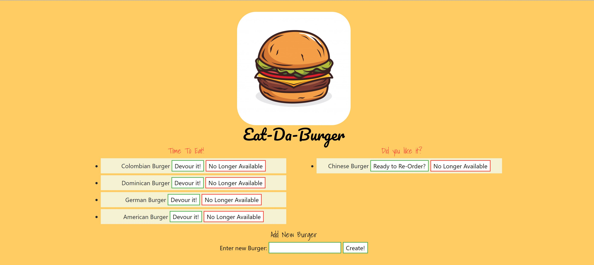

# Eat-da-burger

[Deployed Application]()

## Description

The burger logger app allows users to input the names of burgers they'd like to eat. Whenever a user submits a burger's name, your app will display the burger on the left side of the page - waiting to be devoured. Each burger in the waiting area also has a `Devour it!` button. When the user clicks it, the burger will move to the right side of the page. The app uses MySQL, Node, Express, Handlebars and ORM. 

## Table of Contents

- [Installation](#installation)
- [Usage](#usage)
- [License](#license)
- [Contributing](#contributing)
- [Questions](#questions)

## Installation

To install the app users should download the repository, install the required dependencies listed in the package.JSON file by running "npm i" in the root folder of the repository.

## Usage

After the packages are installed, application will be invoked by running the `npm start` command in the terminal in the root folder of the repository.

## License

N/A

## Contributing

Everyone can contribute and make next version of the app.

## Questions

Contact me for additional questions or to say "Hi":

- [GitHub Profile](https://github.com/kiankovskaia)

- [email](mailto:kiankovskaia@gmail.com)

## Demo

The following video demonstrates the application functionality:

